# 🤖 Gemi: Your Personal AI Assistant
## Complete Vision & Architecture Document

> **Gemi** - A deeply personal AI assistant that knows you, anticipates your needs, and gets things done.

---

## 🎯 Vision Statement

**Gemi is not just a chatbot - it's your second brain and tireless digital assistant.**

It learns everything about you over time, remembers every conversation, anticipates your needs, and can execute real tasks across every domain of your life - from managing your reading list to researching topics, organizing your schedule, helping with code, and anything else you need.

```
"Hey Gemi, I'm stressed about the project deadline tomorrow.
 Can you check what's pending, draft an email to my manager
 about the status, and recommend something light to read tonight?"

Gemi handles all three seamlessly, knowing your communication style,
your project context, and your reading preferences.
```

---

## 🏗️ System Architecture Overview

```mermaid
graph TB
    subgraph "User Interfaces"
        TG[📱 Telegram Bot]
        WEB[🌐 Web Interface<br/>Future]
        VOICE[🎤 Voice Interface<br/>Future]
        API[🔌 API Access<br/>Future]
    end

    subgraph "Core Engine"
        GATEWAY[🚪 Gateway Layer<br/>FastAPI]
        AGENT[🧠 Gemi Agent Core<br/>Claude Agent SDK<br/>Tool Routing via Native Reasoning]
    end

    subgraph "Intelligence Layer"
        MEMORY[💾 Memory System]
        CONTEXT[🎯 Context Builder]
        PROFILE[👤 Personal Profile]
        LEARNING[📈 Meta Learning]
    end

    subgraph "Skills & Tools"
        SKILLS[🛠️ Skills as Tools<br/>Claude picks via description]
        TOOLS[🔧 Tool Executor]
        PLUGINS[🔌 Plugin System]
    end

    subgraph "Storage Layer"
        PG[(PostgreSQL)]
        VECTOR[(Vector DB<br/>Qdrant)]
        REDIS[(Redis Cache)]
        FILES[(File Storage)]
    end

    subgraph "External Services"
        CLAUDE[Claude API]
        SEARCH[Search APIs]
        CALENDAR[Calendar APIs]
        EMAIL[Email Services]
        CUSTOM[Custom APIs]
    end

    TG --> GATEWAY
    WEB --> GATEWAY
    VOICE --> GATEWAY
    API --> GATEWAY

    GATEWAY --> AGENT
    AGENT --> SKILLS
    AGENT --> TOOLS
    SKILLS --> PLUGINS

    AGENT <--> MEMORY
    AGENT <--> CONTEXT
    MEMORY <--> PROFILE
    PROFILE <--> LEARNING

    MEMORY --> PG
    MEMORY --> VECTOR
    MEMORY --> REDIS
    TOOLS --> FILES

    AGENT --> CLAUDE
    TOOLS --> SEARCH
    TOOLS --> CALENDAR
    TOOLS --> EMAIL
    TOOLS --> CUSTOM
```



---

## 🧠 Core Philosophy

### From Chatbot → Personal Intelligence

| Aspect | Traditional Bot | Gemi |
|--------|----------------|------|
| **Memory** | Forgets after session | Remembers everything, forever |
| **Understanding** | Surface-level intent | Deep personal context |
| **Capability** | Information only | Actually does things |
| **Personality** | Generic responses | Deeply personalized to you |
| **Initiative** | Reactive only | Proactive + anticipatory |
| **Learning** | Static | Continuously improving |
| **Scope** | Single domain | All aspects of your life |

### How Claude Agent SDK Powers Gemi

Gemi leverages Claude's native tool use and reasoning capabilities:

**🎯 Natural Intent Understanding**
- Claude reads user messages and decides which tools to use based on tool descriptions
- No separate "intent classifier" needed - Claude's reasoning handles this naturally
- Can combine multiple skills in one response (e.g., check tasks + calendar + suggest reading)

**🛠️ Skills as Tools**
- Each skill is registered as a Claude tool with clear description
- Claude picks the right tools based on:
  - User's request content
  - Tool descriptions and parameters
  - Conversation context and history
  - Personal profile and patterns

**📖 System Prompt as Guide**
- System prompt describes each domain (reading, tasks, code, research, etc.)
- Provides guidelines on when to use which skills
- Enables Claude to understand multi-domain requests naturally

**🔄 Multi-Step Reasoning**
- Claude can chain tools together automatically
- Example: "Help me prepare for tomorrow" → check calendar → check tasks → suggest reading
- No explicit "orchestrator" needed - Claude handles the workflow

---

## 📊 Memory Architecture

### The 5 Memory Layers

```mermaid
graph LR
    subgraph "Memory Layers"
        ST[🔄 Short-Term<br/>Redis<br/>Current Context]
        EP[📅 Episodic<br/>PostgreSQL<br/>Events & Experiences]
        SEM[🧬 Semantic<br/>Vector DB<br/>Knowledge & Meaning]
        PROC[⚙️ Procedural<br/>Patterns & Habits]
        META[📈 Meta<br/>Self-Improvement]
    end

    INPUT[User Interaction] --> ST
    ST --> EP
    ST --> SEM
    EP --> PROC
    SEM --> PROC
    PROC --> META
    META --> |Improves| ST
```



### Memory Schema

```python
MEMORY_ARCHITECTURE = {
    "short_term": {
        # Active conversation context (Redis, 24h TTL)
        "current_task": "researching ML papers",
        "conversation_thread": [...],
        "active_tools": ["web_search", "file_read"],
        "mood_detected": "focused",
        "time_context": {
            "local_time": "10:30 PM",
            "day_type": "weekday",
            "user_energy": "winding down"
        }
    },

    "episodic": {
        # Specific events and experiences (PostgreSQL)
        "events": [
            {
                "type": "task_completed",
                "domain": "work",
                "task": "Finished Q4 report",
                "date": "2026-01-24",
                "emotion": "relieved",
                "context": "Was stressing about this for a week",
                "outcome": "Manager praised the analysis"
            },
            {
                "type": "learning_moment",
                "domain": "reading",
                "book": "Thinking Fast and Slow",
                "insight": "System 1 vs System 2 explains my impulsive decisions",
                "applied_to": "Now I pause before big purchases"
            }
        ]
    },

    "semantic": {
        # Deep knowledge about user (Vector DB)
        "personal_profile": {
            "identity": {
                "name": "Samyak",
                "role": "Software Engineer",
                "location": "Bangalore",
                "timezone": "Asia/Kolkata"
            },
            "preferences": {
                "communication_style": "casual, direct, with humor",
                "decision_making": "data-driven but trusts gut for people",
                "learning_style": "hands-on, examples over theory",
                "work_style": "deep work blocks, night owl"
            },
            "values": ["efficiency", "continuous learning", "authenticity"],
            "goals": {
                "short_term": ["ship the new feature", "read 2 books this month"],
                "long_term": ["build a successful product", "financial independence"]
            }
        },

        "knowledge_domains": {
            "work": {
                "company": "...",
                "team": ["Alice (PM)", "Bob (Designer)", "Carol (Backend)"],
                "projects": {...},
                "pain_points": ["too many meetings", "unclear requirements"],
                "wins": ["optimized API by 40%", "mentored new hire"]
            },
            "reading": {
                "genres_loved": ["sci-fi", "psychology", "business"],
                "authors_followed": ["Sanderson", "Clear", "Newport"],
                "reading_pace": "30-40 pages/hour",
                "current_books": [...]
            },
            "health": {
                "sleep_pattern": "night owl, 1am-8am ideal",
                "exercise": "prefers gym, hates running",
                "diet": "vegetarian, loves South Indian"
            },
            "relationships": {
                "family": {...},
                "close_friends": {...},
                "professional_network": {...}
            }
        },

        "interaction_patterns": {
            "responds_well_to": ["specific suggestions", "data-backed reasoning"],
            "dislikes": ["vague advice", "being rushed", "small talk"],
            "humor_style": "dry, tech references, memes",
            "typical_questions": ["why approach X over Y?", "what's the tradeoff?"]
        }
    },

    "procedural": {
        # Learned patterns and habits
        "daily_patterns": {
            "morning": "checks messages, quick email scan, tea",
            "work_hours": "deep work 10am-1pm, meetings afternoon",
            "evening": "reading or coding side projects",
            "night": "wind down with light content or books"
        },
        "task_patterns": {
            "prefers_tasks_broken_down": True,
            "needs_deadlines": True,
            "responds_to_gentle_nudges": True,
            "hates_micromanagement": True
        },
        "communication_patterns": {
            "telegram_active_hours": ["9am-11am", "8pm-12am"],
            "message_style": "short messages, uses voice notes",
            "response_expectation": "doesn't need immediate replies"
        }
    },

    "meta_learning": {
        # How Gemi improves itself
        "recommendation_accuracy": {
            "books": 0.87,
            "tasks": 0.92,
            "suggestions": 0.78
        },
        "successful_approaches": [
            "Breaking down complex tasks works better than overview",
            "Evening is best time for proactive suggestions",
            "Include 'why' in recommendations"
        ],
        "corrections_received": [
            "User prefers shorter summaries",
            "Don't suggest exercise in mornings"
        ],
        "areas_to_improve": [
            "Better at predicting meeting fatigue",
            "More accurate time estimates for tasks"
        ]
    }
}
```

---

## 🛠️ Skills & Tools Architecture

### Skill System Overview

```mermaid
graph TB
    subgraph "Skill Categories"
        PRODUCTIVITY[📋 Productivity]
        KNOWLEDGE[📚 Knowledge]
        COMMUNICATION[💬 Communication]
        RESEARCH[🔍 Research]
        CREATIVE[🎨 Creative]
        PERSONAL[👤 Personal]
        TECHNICAL[💻 Technical]
        LIFE[🏠 Life Management]
    end

    subgraph "Productivity Skills"
        TASKS[Task Management]
        CALENDAR[Calendar]
        NOTES[Notes & Docs]
        PROJECTS[Project Tracking]
    end

    subgraph "Knowledge Skills"
        READING[Reading Buddy]
        LEARNING[Learning Tracker]
        FLASHCARDS[Spaced Repetition]
        SUMMARIES[Content Summaries]
    end

    subgraph "Research Skills"
        WEBSEARCH[Web Search]
        ACADEMIC[Academic Papers]
        NEWS[News & Trends]
        COMPARISON[Product Research]
    end

    subgraph "Technical Skills"
        CODE[Code Assistant]
        DEBUG[Debugging Help]
        REVIEW[Code Review]
        DOCS[Doc Generation]
    end

    PRODUCTIVITY --> TASKS
    PRODUCTIVITY --> CALENDAR
    PRODUCTIVITY --> NOTES
    PRODUCTIVITY --> PROJECTS

    KNOWLEDGE --> READING
    KNOWLEDGE --> LEARNING
    KNOWLEDGE --> FLASHCARDS
    KNOWLEDGE --> SUMMARIES

    RESEARCH --> WEBSEARCH
    RESEARCH --> ACADEMIC
    RESEARCH --> NEWS
    RESEARCH --> COMPARISON

    TECHNICAL --> CODE
    TECHNICAL --> DEBUG
    TECHNICAL --> REVIEW
    TECHNICAL --> DOCS
```



### How Skills Work with Claude Agent SDK

**Skills are implemented as Claude tools** - Claude automatically routes to them based on:
1. **Tool descriptions**: Clear, detailed descriptions of what each skill does
2. **System prompt**: Domain guidelines that help Claude understand when to use which skills
3. **Context**: Conversation history and user profile inform tool selection
4. **Claude's reasoning**: Native ability to chain tools for complex tasks

**Example: How Claude Picks Skills**

```python
# User says: "I'm stressed about my deadline tomorrow"

# Claude's reasoning process (automatic):
# 1. Analyzes message → detects stress + deadline mention
# 2. Looks at available tools → sees check_tasks, check_calendar, search_books
# 3. Decides to chain: check_tasks → check_calendar → search_books (stress relief)
# 4. Executes tools in sequence
# 5. Synthesizes response combining all results

# No explicit "intent router" needed - Claude figures it out!
```

**Implementation Pattern:**

```python
# Define tools with clear descriptions
def register_gemi_tools():
    """Register all Gemi skills as Claude tools"""

    tools = [
        {
            "name": "search_books",
            "description": """Search for books across multiple sources (Google Books, Goodreads).

            Use this when the user:
            - Asks for book recommendations
            - Wants to find a specific book
            - Mentions reading interests
            - Asks "what should I read?"

            This is part of the READING domain.""",
            "parameters": {
                "query": {"type": "string", "required": True},
                "genre": {"type": "string"},
                "limit": {"type": "integer", "default": 5}
            }
        },
        {
            "name": "create_task",
            "description": """Create a new task with optional deadline and priority.

            Use this when the user:
            - Says "remind me to..." or "I need to..."
            - Mentions something they need to do
            - Asks to create a task or to-do
            - References a deadline or upcoming task

            This is part of the PRODUCTIVITY domain.""",
            "parameters": {
                "title": {"type": "string", "required": True},
                "due_date": {"type": "string"},
                "priority": {"type": "string", "enum": ["low", "medium", "high"]}
            }
        },
        {
            "name": "check_calendar",
            "description": """Check calendar events for a date range.

            Use this when the user:
            - Asks about their schedule
            - Mentions "tomorrow" or "next week"
            - Wants to know if they're free
            - References upcoming meetings/events

            This is part of the PRODUCTIVITY domain.""",
            "parameters": {
                "start_date": {"type": "string", "required": True},
                "end_date": {"type": "string"}
            }
        }
    ]

    return tools

# System prompt guides domain understanding
SYSTEM_PROMPT = """You are Gemi, a multi-domain personal assistant for {user_name}.

## Your Domains

**📚 READING**: Help with books, reading lists, recommendations
- Use: search_books, track_reading, add_to_reading_list

**📋 PRODUCTIVITY**: Manage tasks, calendar, notes
- Use: create_task, check_calendar, list_tasks

**🔍 RESEARCH**: Web search, information gathering
- Use: web_search, research_topic

**💻 CODE**: Programming help and debugging
- Use: explain_code, debug_code, review_code

## How to Help

1. **Understand the domain** - What is the user asking about?
2. **Pick relevant tools** - Use tools from that domain
3. **Chain tools when needed** - Complex requests may need multiple tools
4. **Personalize** - Use conversation context and user profile

Example multi-domain request:
"Help me prepare for tomorrow" →
1. check_calendar (tomorrow) → see what's scheduled
2. list_tasks (due: tomorrow) → see pending work
3. search_books (stress relief) → suggest reading if stressed

You naturally decide which tools to use - no explicit routing needed!"""
```

### Core Skills Registry

```python
SKILLS_REGISTRY = {
    # ==========================================
    # 📋 PRODUCTIVITY
    # ==========================================
    "task_manager": {
        "name": "Task Manager",
        "trigger": "/task",
        "description": "Create, track, and manage tasks",
        "capabilities": [
            "Create tasks with deadlines and priorities",
            "Break down complex tasks into subtasks",
            "Track progress and completion",
            "Smart reminders based on patterns",
            "Daily/weekly task summaries"
        ],
        "tools_used": ["database", "notifications", "calendar_api"],
        "examples": [
            "/task Add 'Review PR #123' due tomorrow high priority",
            "/task list today",
            "/task What should I focus on?",
            "Remind me to call mom this weekend"
        ]
    },

    "calendar_assistant": {
        "name": "Calendar Assistant",
        "trigger": "/cal",
        "description": "Manage schedule and meetings",
        "capabilities": [
            "View and manage calendar events",
            "Find free slots for meetings",
            "Schedule based on energy patterns",
            "Meeting prep summaries",
            "Travel time calculations"
        ],
        "tools_used": ["google_calendar_api", "maps_api"],
        "integrations": ["Google Calendar", "Outlook"]
    },

    "notes_manager": {
        "name": "Notes & Knowledge",
        "trigger": "/note",
        "description": "Capture and organize thoughts",
        "capabilities": [
            "Quick capture via text/voice",
            "Auto-tagging and categorization",
            "Link related notes",
            "Search across all notes",
            "Export to Notion/Obsidian"
        ],
        "tools_used": ["vector_search", "ocr", "speech_to_text"]
    },

    # ==========================================
    # 📚 KNOWLEDGE & LEARNING
    # ==========================================
    "reading_buddy": {
        "name": "Reading Buddy",
        "trigger": "/read",
        "description": "Your personal reading companion",
        "capabilities": [
            "Track books and reading progress",
            "Smart book recommendations",
            "Reading sessions with timer",
            "Notes and quote capture",
            "Reading analytics and streaks"
        ],
        "tools_used": ["google_books_api", "goodreads_api", "ocr"]
    },

    "learning_tracker": {
        "name": "Learning Tracker",
        "trigger": "/learn",
        "description": "Track and optimize learning",
        "capabilities": [
            "Course progress tracking",
            "Spaced repetition reminders",
            "Learning path suggestions",
            "Knowledge gap analysis",
            "Study session management"
        ]
    },

    "content_summarizer": {
        "name": "Content Summarizer",
        "trigger": "/summarize",
        "description": "Summarize any content",
        "capabilities": [
            "Article/webpage summaries",
            "PDF document summaries",
            "Video transcript summaries",
            "Book chapter summaries",
            "Meeting notes generation"
        ],
        "tools_used": ["web_fetch", "pdf_parser", "youtube_api"]
    },

    # ==========================================
    # 🔍 RESEARCH
    # ==========================================
    "web_researcher": {
        "name": "Web Researcher",
        "trigger": "/search",
        "description": "Research any topic thoroughly",
        "capabilities": [
            "Multi-source web search",
            "Fact verification",
            "Comparison tables",
            "Source credibility assessment",
            "Research reports generation"
        ],
        "tools_used": ["search_api", "web_scraper", "fact_checker"]
    },

    "product_researcher": {
        "name": "Product Researcher",
        "trigger": "/compare",
        "description": "Research products and services",
        "capabilities": [
            "Product comparisons",
            "Review aggregation",
            "Price tracking",
            "Pros/cons analysis",
            "Personalized recommendations"
        ],
        "tools_used": ["search_api", "price_api", "review_api"]
    },

    # ==========================================
    # 💬 COMMUNICATION
    # ==========================================
    "email_assistant": {
        "name": "Email Assistant",
        "trigger": "/email",
        "description": "Help with email management",
        "capabilities": [
            "Draft emails in your style",
            "Summarize email threads",
            "Suggest responses",
            "Email templates",
            "Follow-up reminders"
        ],
        "tools_used": ["email_api", "template_engine"],
        "integrations": ["Gmail", "Outlook"]
    },

    "message_crafter": {
        "name": "Message Crafter",
        "trigger": "/draft",
        "description": "Help craft messages",
        "capabilities": [
            "Professional messages",
            "Difficult conversations",
            "Social media posts",
            "Thank you notes",
            "Apologies and explanations"
        ]
    },

    # ==========================================
    # 💻 TECHNICAL
    # ==========================================
    "code_assistant": {
        "name": "Code Assistant",
        "trigger": "/code",
        "description": "Help with programming tasks",
        "capabilities": [
            "Code generation",
            "Bug debugging",
            "Code review",
            "Documentation",
            "Architecture suggestions"
        ],
        "tools_used": ["code_executor", "file_system", "git_api"]
    },

    "devops_helper": {
        "name": "DevOps Helper",
        "trigger": "/devops",
        "description": "Help with infrastructure",
        "capabilities": [
            "Docker/K8s configs",
            "CI/CD pipeline help",
            "Cloud resource management",
            "Log analysis",
            "Incident response"
        ],
        "tools_used": ["shell_executor", "cloud_apis", "log_parser"]
    },

    # ==========================================
    # 👤 PERSONAL
    # ==========================================
    "health_tracker": {
        "name": "Health Tracker",
        "trigger": "/health",
        "description": "Track health and wellness",
        "capabilities": [
            "Sleep tracking",
            "Exercise logging",
            "Mood tracking",
            "Habit tracking",
            "Health insights"
        ]
    },

    "finance_tracker": {
        "name": "Finance Tracker",
        "trigger": "/money",
        "description": "Track expenses and budget",
        "capabilities": [
            "Expense logging",
            "Budget tracking",
            "Spending insights",
            "Bill reminders",
            "Savings goals"
        ]
    },

    # ==========================================
    # 🏠 LIFE MANAGEMENT
    # ==========================================
    "travel_planner": {
        "name": "Travel Planner",
        "trigger": "/travel",
        "description": "Plan and manage travel",
        "capabilities": [
            "Trip planning",
            "Itinerary creation",
            "Flight/hotel research",
            "Packing lists",
            "Travel reminders"
        ],
        "tools_used": ["flight_api", "hotel_api", "maps_api"]
    },

    "shopping_assistant": {
        "name": "Shopping Assistant",
        "trigger": "/shop",
        "description": "Help with shopping decisions",
        "capabilities": [
            "Product recommendations",
            "Price comparisons",
            "Shopping list management",
            "Deal alerts",
            "Purchase tracking"
        ]
    }
}
```

---

## 🔧 Tool System

### Tool Categories

```mermaid
graph TB
    subgraph "Tool Categories"
        INFO[📖 Information Tools]
        ACTION[⚡ Action Tools]
        ANALYSIS[📊 Analysis Tools]
        CREATION[✨ Creation Tools]
        INTEGRATION[🔗 Integration Tools]
    end

    subgraph "Information Tools"
        WEB_FETCH[Web Fetch]
        FILE_READ[File Read]
        DB_QUERY[Database Query]
        API_CALL[API Call]
    end

    subgraph "Action Tools"
        FILE_WRITE[File Write]
        SEND_MSG[Send Message]
        SCHEDULE[Schedule Task]
        EXECUTE[Execute Code]
    end

    subgraph "Analysis Tools"
        SUMMARIZE[Summarize]
        COMPARE[Compare]
        EXTRACT[Extract Data]
        VISUALIZE[Visualize]
    end

    subgraph "Creation Tools"
        GENERATE[Generate Content]
        DRAFT[Draft Document]
        CODE_GEN[Generate Code]
        IMAGE_GEN[Generate Image]
    end

    subgraph "Integration Tools"
        CALENDAR_INT[Calendar]
        EMAIL_INT[Email]
        NOTION_INT[Notion]
        GITHUB_INT[GitHub]
    end

    INFO --> WEB_FETCH
    INFO --> FILE_READ
    INFO --> DB_QUERY
    INFO --> API_CALL

    ACTION --> FILE_WRITE
    ACTION --> SEND_MSG
    ACTION --> SCHEDULE
    ACTION --> EXECUTE

    ANALYSIS --> SUMMARIZE
    ANALYSIS --> COMPARE
    ANALYSIS --> EXTRACT
    ANALYSIS --> VISUALIZE

    CREATION --> GENERATE
    CREATION --> DRAFT
    CREATION --> CODE_GEN
    CREATION --> IMAGE_GEN

    INTEGRATION --> CALENDAR_INT
    INTEGRATION --> EMAIL_INT
    INTEGRATION --> NOTION_INT
    INTEGRATION --> GITHUB_INT
```



### Tool Definitions

```python
TOOLS = {
    # ==========================================
    # 📖 INFORMATION RETRIEVAL
    # ==========================================
    "web_search": {
        "name": "web_search",
        "description": "Search the web for information",
        "parameters": {
            "query": {"type": "string", "required": True},
            "num_results": {"type": "integer", "default": 5},
            "time_filter": {"type": "string", "enum": ["day", "week", "month", "year"]}
        },
        "returns": "List of search results with titles, snippets, URLs"
    },

    "web_fetch": {
        "name": "web_fetch",
        "description": "Fetch and parse content from a URL",
        "parameters": {
            "url": {"type": "string", "required": True},
            "extract": {"type": "string", "enum": ["full", "article", "summary"]}
        },
        "returns": "Parsed content from the webpage"
    },

    "file_read": {
        "name": "file_read",
        "description": "Read contents of a file",
        "parameters": {
            "path": {"type": "string", "required": True},
            "encoding": {"type": "string", "default": "utf-8"}
        },
        "returns": "File contents"
    },

    "database_query": {
        "name": "database_query",
        "description": "Query the user's personal database",
        "parameters": {
            "collection": {"type": "string", "required": True},
            "query": {"type": "object", "required": True},
            "limit": {"type": "integer", "default": 10}
        },
        "returns": "Query results"
    },

    # ==========================================
    # ⚡ ACTIONS
    # ==========================================
    "file_write": {
        "name": "file_write",
        "description": "Write content to a file",
        "parameters": {
            "path": {"type": "string", "required": True},
            "content": {"type": "string", "required": True},
            "mode": {"type": "string", "enum": ["write", "append"], "default": "write"}
        },
        "returns": "Success status and file path"
    },

    "send_telegram_message": {
        "name": "send_telegram_message",
        "description": "Send a message on Telegram",
        "parameters": {
            "text": {"type": "string", "required": True},
            "parse_mode": {"type": "string", "enum": ["Markdown", "HTML"]},
            "reply_markup": {"type": "object"}
        },
        "returns": "Message ID"
    },

    "schedule_task": {
        "name": "schedule_task",
        "description": "Schedule a future task or reminder",
        "parameters": {
            "task": {"type": "string", "required": True},
            "when": {"type": "string", "required": True},
            "repeat": {"type": "string", "enum": ["once", "daily", "weekly", "monthly"]}
        },
        "returns": "Scheduled task ID"
    },

    "execute_code": {
        "name": "execute_code",
        "description": "Execute code in a sandboxed environment",
        "parameters": {
            "language": {"type": "string", "required": True},
            "code": {"type": "string", "required": True},
            "timeout": {"type": "integer", "default": 30}
        },
        "returns": "Execution output or error"
    },

    # ==========================================
    # 🔗 INTEGRATIONS
    # ==========================================
    "calendar_read": {
        "name": "calendar_read",
        "description": "Read calendar events",
        "parameters": {
            "start_date": {"type": "string", "required": True},
            "end_date": {"type": "string", "required": True}
        },
        "returns": "List of calendar events"
    },

    "calendar_create": {
        "name": "calendar_create",
        "description": "Create a calendar event",
        "parameters": {
            "title": {"type": "string", "required": True},
            "start": {"type": "string", "required": True},
            "end": {"type": "string", "required": True},
            "description": {"type": "string"},
            "attendees": {"type": "array"}
        },
        "returns": "Created event ID"
    },

    "email_send": {
        "name": "email_send",
        "description": "Send an email",
        "parameters": {
            "to": {"type": "string", "required": True},
            "subject": {"type": "string", "required": True},
            "body": {"type": "string", "required": True},
            "cc": {"type": "array"},
            "attachments": {"type": "array"}
        },
        "returns": "Sent email ID"
    },

    "notion_create_page": {
        "name": "notion_create_page",
        "description": "Create a page in Notion",
        "parameters": {
            "database_id": {"type": "string", "required": True},
            "properties": {"type": "object", "required": True},
            "content": {"type": "string"}
        },
        "returns": "Created page ID"
    },

    "github_create_issue": {
        "name": "github_create_issue",
        "description": "Create a GitHub issue",
        "parameters": {
            "repo": {"type": "string", "required": True},
            "title": {"type": "string", "required": True},
            "body": {"type": "string"},
            "labels": {"type": "array"}
        },
        "returns": "Issue URL"
    }
}
```

### Implementation Example: Agent Core

```python
from claude_agent_sdk import ClaudeSDKClient, ClaudeAgentOptions
from claude_agent_sdk.types import AssistantMessage, TextBlock, ToolUseBlock

class GemiAgent:
    """Core Gemi agent using Claude Agent SDK"""

    def __init__(self, user_id: str):
        self.user_id = user_id
        self.memory = MemoryManager(user_id)
        self.tools = self._register_tools()

    def _register_tools(self):
        """Register all domain tools - Claude will route to them automatically"""
        return {
            # Reading domain
            "search_books": skills.reading.search_books,
            "track_reading": skills.reading.track_progress,
            "add_to_list": skills.reading.add_to_list,

            # Tasks domain
            "create_task": skills.tasks.create_task,
            "list_tasks": skills.tasks.list_tasks,
            "complete_task": skills.tasks.complete_task,

            # Calendar domain
            "check_calendar": skills.calendar.check_schedule,
            "add_event": skills.calendar.add_event,

            # Research domain
            "web_search": skills.research.web_search,
            "research_topic": skills.research.research_topic,

            # Code domain
            "explain_code": skills.code.explain_code,
            "debug_code": skills.code.debug,
        }

    async def process_message(self, message: str) -> str:
        """Process user message - Claude handles all routing via tool use"""

        # 1. Build context from memory
        context = await self.memory.build_context()
        profile = await self.memory.get_profile()

        # 2. Build system prompt with domain guidelines
        system_prompt = self._build_system_prompt(profile, context)

        # 3. Initialize Claude Agent SDK
        options = ClaudeAgentOptions(
            system_prompt=system_prompt,
            allowed_tools=list(self.tools.keys()),
            model="claude-3-5-sonnet-20241022"
        )

        client = ClaudeSDKClient(options)
        await client.connect()

        # 4. Send message - Claude decides which tools to use
        await client.query(message)

        # 5. Process Claude's response and tool calls
        response_text = ""
        tool_results = []

        async for msg in client.receive_response():
            if isinstance(msg, AssistantMessage):
                for block in msg.content:
                    if isinstance(block, TextBlock):
                        response_text += block.text

                    elif isinstance(block, ToolUseBlock):
                        # Claude chose this tool - execute it
                        tool_name = block.name
                        tool_input = block.input

                        print(f"🔧 Claude chose tool: {tool_name}")
                        result = await self._execute_tool(tool_name, tool_input)
                        tool_results.append(result)

                        # Feed result back to Claude for next decision
                        await client.send_tool_result(block.id, result)

        # 6. Store interaction in memory
        await self.memory.remember_interaction({
            "user_message": message,
            "assistant_response": response_text,
            "tools_used": [r["tool"] for r in tool_results],
            "timestamp": datetime.now()
        })

        return response_text

    def _build_system_prompt(self, profile: dict, context: dict) -> str:
        """Build dynamic system prompt with user context"""

        base_prompt = f"""You are Gemi, a personal AI assistant for {profile['name']}.

## About {profile['name']}
{self._format_profile(profile)}

## Recent Context
{self._format_context(context)}

## Your Domains & Tools

**📚 READING**: {profile['name']} loves {", ".join(profile['reading']['genres'])}.
Use reading tools when they ask about books or reading.

**📋 TASKS**: {profile['name']} is {profile['work']['role']}.
Use task tools when they mention work or to-dos.

**🔍 RESEARCH**: Use research tools for information gathering.
**💻 CODE**: Use code tools when they share code or ask programming questions.

## Communication Style
{profile['preferences']['communication_style']}

You naturally understand which domain a request belongs to and select appropriate tools.
You can combine multiple domains in a single response when relevant."""

        return base_prompt

    async def _execute_tool(self, tool_name: str, params: dict) -> dict:
        """Execute a tool chosen by Claude"""

        if tool_name not in self.tools:
            return {"error": f"Unknown tool: {tool_name}"}

        try:
            # Execute the tool function
            tool_func = self.tools[tool_name]
            result = await tool_func(self.user_id, **params)

            return {
                "tool": tool_name,
                "success": True,
                "result": result
            }

        except Exception as e:
            return {
                "tool": tool_name,
                "success": False,
                "error": str(e)
            }
```

**Key Points:**
- ✅ No Intent Router - Claude decides based on tool descriptions
- ✅ No Task Orchestrator - Claude chains tools naturally
- ✅ System prompt provides domain guidance
- ✅ Tool descriptions are the "routing rules"
- ✅ Claude's reasoning handles complex multi-domain requests

---

## 🔄 Request Processing Flow


---

## 🎭 Proactive Agent System

### Proactive Triggers

```mermaid
graph TB
    subgraph "Trigger Sources"
        TIME[⏰ Time-Based]
        EVENT[📅 Event-Based]
        PATTERN[📊 Pattern-Based]
        CONTEXT[🎯 Context-Based]
    end

    subgraph "Time-Based Triggers"
        MORNING[Morning Brief]
        EVENING[Evening Summary]
        WEEKLY[Weekly Review]
        CUSTOM[Custom Reminders]
    end

    subgraph "Event-Based Triggers"
        CALENDAR_E[Calendar Events]
        DEADLINE[Approaching Deadlines]
        COMPLETION[Task Completion]
        EXTERNAL[External Events]
    end

    subgraph "Pattern-Based Triggers"
        STREAK[Streak at Risk]
        HABIT[Habit Patterns]
        PRODUCTIVITY[Productivity Dips]
        MOOD[Mood Patterns]
    end

    subgraph "Context-Based Triggers"
        LOCATION[Location Change]
        WEATHER[Weather Conditions]
        NEWS[Relevant News]
        SOCIAL[Social Context]
    end

    TIME --> MORNING
    TIME --> EVENING
    TIME --> WEEKLY
    TIME --> CUSTOM

    EVENT --> CALENDAR_E
    EVENT --> DEADLINE
    EVENT --> COMPLETION
    EVENT --> EXTERNAL

    PATTERN --> STREAK
    PATTERN --> HABIT
    PATTERN --> PRODUCTIVITY
    PATTERN --> MOOD

    CONTEXT --> LOCATION
    CONTEXT --> WEATHER
    CONTEXT --> NEWS
    CONTEXT --> SOCIAL
```



### Proactive Agent Implementation

```python
class ProactiveAgent:
    """Background agent that reaches out proactively"""

    async def run_scheduled_checks(self, user_id: str):
        """Run all scheduled proactive checks"""

        profile = await self.memory.get_profile(user_id)
        current_time = datetime.now()

        # Determine what checks to run based on time
        checks = self._get_applicable_checks(current_time, profile)

        for check in checks:
            should_notify, message = await check(user_id)
            if should_notify:
                await self._send_proactive_message(user_id, message)

    async def morning_brief(self, user_id: str) -> tuple[bool, str]:
        """Generate personalized morning brief"""

        brief_data = await self._gather_morning_data(user_id)

        prompt = f"""Generate a personalized morning brief for {profile['name']}.

Data:
- Weather: {brief_data['weather']}
- Calendar today: {brief_data['calendar']}
- Pending tasks: {brief_data['tasks']}
- Reading streak: {brief_data['reading_streak']}
- Yesterday's highlights: {brief_data['yesterday']}

Style: {profile['preferred_morning_style']}
Length: Concise, scannable
Tone: Energizing but not overwhelming"""

        brief = await self.claude.generate(prompt)
        return True, brief

    async def evening_summary(self, user_id: str) -> tuple[bool, str]:
        """Generate end-of-day summary"""

        day_data = await self._gather_day_data(user_id)

        summary = f"""📊 **Your Day in Review**

✅ **Completed**: {len(day_data['completed_tasks'])} tasks
📖 **Read**: {day_data['pages_read']} pages
⏱️ **Productive time**: {day_data['productive_hours']}h

**Highlights**:
{self._format_highlights(day_data['highlights'])}

**Tomorrow's Focus**:
{self._format_tomorrow_focus(day_data['tomorrow'])}

Ready for a good rest? 🌙"""

        return True, summary

    async def check_streak_risk(self, user_id: str) -> tuple[bool, str]:
        """Check if any streak is at risk"""

        streaks = await self.memory.get_streaks(user_id)
        at_risk = [s for s in streaks if s['hours_remaining'] < 4]

        if not at_risk:
            return False, ""

        streak = at_risk[0]  # Most urgent
        message = await self._generate_streak_nudge(user_id, streak)

        return True, message

    async def smart_suggestion(self, user_id: str) -> tuple[bool, str]:
        """Generate context-aware suggestions"""

        context = await self._analyze_current_context(user_id)

        # Only suggest if timing is right
        if not self._is_good_time_to_suggest(context):
            return False, ""

        suggestion = await self._generate_suggestion(user_id, context)
        return True, suggestion
```

---

## 📱 Telegram Bot Interface

### Command Structure

```python
TELEGRAM_COMMANDS = {
    # Core commands
    "/start": "Start Gemi and see welcome message",
    "/help": "Get help and see available commands",
    "/settings": "Configure your preferences",

    # Quick actions
    "/task": "Manage tasks",
    "/note": "Quick note capture",
    "/read": "Reading buddy",
    "/search": "Search the web",
    "/remind": "Set a reminder",

    # Skills
    "/cal": "Calendar assistant",
    "/email": "Email assistant",
    "/code": "Code assistant",
    "/learn": "Learning tracker",

    # Status
    "/today": "Today's overview",
    "/stats": "Your statistics",
    "/streak": "Check streaks",

    # Memory
    "/remember": "Save something to memory",
    "/recall": "Search your memories",
    "/profile": "View your profile"
}
```

### Conversation Flow


---

## 🗄️ Database Schema

### PostgreSQL Schema

```sql
-- Core Tables
CREATE TABLE users (
    id BIGINT PRIMARY KEY,  -- Telegram user ID
    username VARCHAR(255),
    first_name VARCHAR(255),
    timezone VARCHAR(50) DEFAULT 'UTC',
    settings JSONB DEFAULT '{}',
    created_at TIMESTAMP DEFAULT NOW(),
    last_active TIMESTAMP DEFAULT NOW()
);

-- User Profile (semantic memory)
CREATE TABLE user_profiles (
    user_id BIGINT PRIMARY KEY REFERENCES users(id),
    identity JSONB,           -- name, role, location
    preferences JSONB,        -- communication style, work style
    values TEXT[],
    goals JSONB,              -- short-term, long-term
    domains JSONB,            -- work, health, relationships, etc.
    interaction_patterns JSONB,
    updated_at TIMESTAMP DEFAULT NOW()
);

-- Episodic Memory
CREATE TABLE memory_events (
    id SERIAL PRIMARY KEY,
    user_id BIGINT REFERENCES users(id),
    event_type VARCHAR(50),
    domain VARCHAR(50),
    content TEXT NOT NULL,
    context JSONB,
    emotion VARCHAR(50),
    importance FLOAT DEFAULT 0.5,
    created_at TIMESTAMP DEFAULT NOW()
);

-- Tasks
CREATE TABLE tasks (
    id SERIAL PRIMARY KEY,
    user_id BIGINT REFERENCES users(id),
    title VARCHAR(500) NOT NULL,
    description TEXT,
    status VARCHAR(20) DEFAULT 'pending',
    priority VARCHAR(20) DEFAULT 'medium',
    due_date TIMESTAMP,
    completed_at TIMESTAMP,
    tags TEXT[],
    metadata JSONB,
    created_at TIMESTAMP DEFAULT NOW()
);

-- Notes
CREATE TABLE notes (
    id SERIAL PRIMARY KEY,
    user_id BIGINT REFERENCES users(id),
    content TEXT NOT NULL,
    note_type VARCHAR(50),
    tags TEXT[],
    source VARCHAR(50),  -- 'voice', 'text', 'photo'
    metadata JSONB,
    created_at TIMESTAMP DEFAULT NOW()
);

-- Books (Reading Buddy)
CREATE TABLE books (
    id SERIAL PRIMARY KEY,
    title VARCHAR(500) NOT NULL,
    author VARCHAR(500),
    isbn VARCHAR(20),
    genre VARCHAR(100),
    pages INT,
    cover_url TEXT,
    metadata JSONB,
    created_at TIMESTAMP DEFAULT NOW()
);

CREATE TABLE user_books (
    id SERIAL PRIMARY KEY,
    user_id BIGINT REFERENCES users(id),
    book_id INT REFERENCES books(id),
    status VARCHAR(20),
    progress_pages INT DEFAULT 0,
    rating INT,
    started_at TIMESTAMP,
    finished_at TIMESTAMP,
    notes TEXT,
    UNIQUE(user_id, book_id)
);

CREATE TABLE reading_sessions (
    id SERIAL PRIMARY KEY,
    user_id BIGINT REFERENCES users(id),
    book_id INT REFERENCES books(id),
    start_time TIMESTAMP,
    end_time TIMESTAMP,
    pages_read INT,
    notes TEXT[]
);

-- Conversations (for context)
CREATE TABLE conversations (
    id SERIAL PRIMARY KEY,
    user_id BIGINT REFERENCES users(id),
    message_id BIGINT,
    role VARCHAR(20),
    content TEXT,
    metadata JSONB,
    created_at TIMESTAMP DEFAULT NOW()
);

-- Scheduled Tasks (proactive)
CREATE TABLE scheduled_tasks (
    id SERIAL PRIMARY KEY,
    user_id BIGINT REFERENCES users(id),
    task_type VARCHAR(50),
    payload JSONB,
    scheduled_for TIMESTAMP,
    repeat_pattern VARCHAR(50),
    last_run TIMESTAMP,
    next_run TIMESTAMP,
    enabled BOOLEAN DEFAULT TRUE
);

-- Streaks
CREATE TABLE streaks (
    id SERIAL PRIMARY KEY,
    user_id BIGINT REFERENCES users(id),
    streak_type VARCHAR(50),
    current_count INT DEFAULT 0,
    best_count INT DEFAULT 0,
    last_activity TIMESTAMP,
    UNIQUE(user_id, streak_type)
);

-- Indexes
CREATE INDEX idx_memory_events_user ON memory_events(user_id, created_at DESC);
CREATE INDEX idx_tasks_user_status ON tasks(user_id, status);
CREATE INDEX idx_conversations_user ON conversations(user_id, created_at DESC);
CREATE INDEX idx_notes_search ON notes USING gin(to_tsvector('english', content));
```

---

## 🚀 Implementation Roadmap

### Phase 1: Foundation (Weeks 1-2)
**Goal**: Core bot with memory

```
✅ Project setup (FastAPI + Telegram)
✅ Claude Agent SDK integration
✅ PostgreSQL models
✅ Basic memory layer (Redis + PostgreSQL)
✅ Core commands (/start, /help, /task, /note)
✅ Context-aware responses
✅ Conversation tracking
```

### Phase 2: Deep Memory (Weeks 3-4)
**Goal**: Multi-layer memory system

```
□ Vector database setup (Qdrant)
□ Embedding pipeline
□ Context builder from conversations
□ User profile builder
□ Semantic search
□ Dynamic system prompts
□ Memory recall and citation
```

### Phase 3: Skills System (Weeks 5-6)
**Goal**: Multi-domain tool capabilities

```
□ Tool registration system
□ Domain-specific tool implementations:
  □ Task management tools (create_task, list_tasks, complete_task)
  □ Notes tools (capture_note, search_notes)
  □ Reading tools (search_books, track_reading) - port existing
  □ Research tools (web_search, research_topic)
□ Tool description best practices
□ System prompt domain guidelines
□ Multi-tool response handling
□ Test Claude's tool chaining
```

### Phase 4: Integrations (Weeks 7-8)
**Goal**: External service connections

```
□ Google Calendar integration
□ Gmail integration
□ Notion integration
□ GitHub integration
□ Generic webhook system
```

### Phase 5: Proactive Agent (Weeks 9-10)
**Goal**: Bot that reaches out first

```
□ Background task system (Celery)
□ Proactive notification engine
□ Morning brief
□ Evening summary
□ Streak monitoring
□ Smart suggestions
□ Custom reminders
```

### Phase 6: Advanced Features (Weeks 11-12)
**Goal**: Power user features

```
□ Voice note processing
□ Photo/document analysis
□ Code assistant skill
□ Multi-step task execution
□ Learning/improvement loop
□ Analytics dashboard
```

### Phase 7: Polish & Scale (Weeks 13-14)
**Goal**: Production ready

```
□ Performance optimization
□ Error handling & recovery
□ Monitoring (Sentry, Prometheus)
□ User onboarding flow
□ Documentation
□ Docker deployment
□ CI/CD pipeline
```

---

## 🏗️ Technical Stack

```yaml
Core:
  Language: Python 3.11+
  Framework: FastAPI
  Agent: Claude Agent SDK
  Bot: python-telegram-bot (async)

Storage:
  Primary DB: PostgreSQL 15+
  Vector DB: Qdrant
  Cache: Redis
  Files: Local / S3

Background:
  Queue: Celery + Redis
  Scheduler: APScheduler

Monitoring:
  Errors: Sentry
  Metrics: Prometheus + Grafana
  Logging: Loguru

ML/AI:
  LLM: Claude 3.5 Sonnet
  Embeddings: text-embedding-3-small
  Speech: Whisper
  Vision: Claude Vision

Infrastructure:
  Container: Docker
  Orchestration: Docker Compose (dev), K8s (prod)
  CI/CD: GitHub Actions
```

---

## 📁 Project Structure

```
gemi/
├── src/
│   ├── main.py                      # FastAPI entry
│   │
│   ├── bot/
│   │   ├── telegram.py              # Telegram bot
│   │   ├── handlers/                # Message handlers
│   │   └── middleware/              # Auth, rate limit
│   │
│   ├── agent/
│   │   ├── core.py                  # Gemi Agent (Claude SDK)
│   │   │                            # Claude handles routing via tool descriptions
│   │   ├── system_prompt.py         # Dynamic system prompt builder
│   │   ├── tools/                   # Tool implementations
│   │   │   ├── base.py              # Tool base class
│   │   │   ├── reading.py           # Reading tools
│   │   │   ├── tasks.py             # Task management tools
│   │   │   ├── research.py          # Web research tools
│   │   │   ├── code.py              # Code assistance tools
│   │   │   └── calendar.py          # Calendar tools
│   │   │
│   │   └── skills/                  # Skill-specific logic
│   │       ├── reading_buddy.py
│   │       ├── task_manager.py
│   │       ├── code_assistant.py
│   │       └── web_researcher.py
│   │
│   ├── memory/
│   │   ├── manager.py               # Memory orchestrator
│   │   ├── context.py               # Context builder
│   │   ├── profile.py               # User profile
│   │   ├── embeddings.py            # Vector embeddings
│   │   └── layers/                  # Memory layer implementations
│   │
│   ├── proactive/
│   │   ├── agent.py                 # Proactive agent
│   │   ├── triggers.py              # Trigger definitions
│   │   └── templates.py             # Message templates
│   │
│   ├── integrations/
│   │   ├── google/                  # Google APIs
│   │   ├── notion/                  # Notion API
│   │   ├── github/                  # GitHub API
│   │   └── email/                   # Email services
│   │
│   ├── models/                      # Database models
│   ├── api/                         # API routes
│   ├── db/                          # Database connections
│   ├── tasks/                       # Background tasks
│   └── utils/                       # Utilities
│
├── prompts/                         # Prompt templates
│   ├── base_system.txt              # Core Gemi persona
│   └── domains/                     # Domain guidelines
│       ├── reading.txt
│       ├── tasks.txt
│       ├── code.txt
│       └── research.txt
│
├── tests/
├── migrations/
├── docker/
├── scripts/
└── config/
```

---

## 🎨 Why This Architecture?

### Claude-Native Design Advantages

**🚫 What We DON'T Have (and why that's good):**

1. **No Intent Router**
   - ❌ Traditional approach: Separate ML model classifies intent → routes to skill
   - ✅ Gemi approach: Claude reads message → understands intent → picks tools
   - **Benefit**: More flexible, handles ambiguity, understands nuance and context

2. **No Task Orchestrator**
   - ❌ Traditional approach: Pre-defined workflows, rigid step sequencing
   - ✅ Gemi approach: Claude reasons about next steps dynamically
   - **Benefit**: Handles unexpected situations, adapts workflow on the fly

3. **No Manual Command Dispatch**
   - ❌ Traditional approach: `/task`, `/read`, `/code` strict commands
   - ✅ Gemi approach: Natural language "I need to finish the report"
   - **Benefit**: More natural conversation, less cognitive load on user

**✨ What We DO Have:**

1. **Smart Tool Descriptions**: Each tool clearly describes when to use it
2. **Rich System Prompt**: Domain guidelines help Claude understand context
3. **Memory Context**: Past interactions inform tool selection
4. **Claude's Reasoning**: Native ability to chain tools and handle complexity

**Example: Multi-Domain Request**

```
User: "I'm stressed about tomorrow's presentation"

Traditional bot with router:
1. Intent classifier: "task_query" (misses stress + reading context)
2. Routes to task_manager skill only
3. Lists tasks for tomorrow
4. Misses opportunity to help with stress or suggest preparation

Gemi with Claude's native routing:
1. Claude understands: stress + presentation + tomorrow
2. Reasons: check calendar → check tasks → assess prep status → suggest stress relief
3. Uses 4 tools: check_calendar, list_tasks, check_document_status, search_books
4. Synthesizes: "You have 3 hours free tonight, 2 slides left, here's a calming book"
5. Proactively helpful across multiple domains
```

**When would you need an explicit router?**
- Sub-50ms latency requirement (Gemi doesn't need this)
- Extreme cost optimization (premature for MVP)
- Specialized lightweight models (unnecessary with Claude's capability)

For Gemi, Claude's native routing is **superior** because:
- 🧠 Better contextual understanding
- 🔗 Natural tool chaining
- 🎯 Handles multi-domain requests
- 🛠️ Easy to add new tools (just add description)
- 📈 Improves as Claude improves

---

## 🌟 Killer Features

1. **🧠 Total Recall** - Remembers everything, forever, semantically searchable
2. **🎯 Deep Personalization** - Learns your style, preferences, patterns
3. **⚡ Actually Gets Things Done** - Tools to execute real tasks
4. **🔮 Anticipatory** - Knows what you need before you ask
5. **📊 Personal Analytics** - Insights about your life patterns
6. **🔗 Connected** - Integrates with your existing tools
7. **🗣️ Natural Conversation** - Talks like a friend, not a bot
8. **📚 Domain Expert** - Deep skills in areas that matter to you
9. **🔄 Continuous Learning** - Gets better at helping you over time
10. **🛡️ Privacy First** - Your data stays yours

---

## 💡 Example Interactions

### Multi-Domain Task
```
User: I'm stressed about the presentation tomorrow. Can you help?

Gemi: I can see you have "Q4 Review Presentation" at 2pm tomorrow.
Let me help! Here's what I can do:

1. 📋 Review your prep tasks (3 incomplete)
2. 📊 Check your slides (last edited 2 days ago)
3. 📖 You mentioned wanting to read something light when stressed -
   "Project Hail Mary" has great reviews for unwinding
4. 🎯 Block focus time tonight for final prep

What would help most right now?

User: Let's tackle the tasks and then maybe some reading

Gemi: Perfect combo! Here are your presentation tasks:
✅ Draft key points - Done
⏳ Review competitor data - In progress
⬜ Practice run-through - Not started

For the competitor data, I found your notes from last week.
Want me to pull them up and help organize?
```

### Proactive Outreach
```
Gemi: 🌙 Quick evening check-in, Samyak!

Today was productive:
✅ 4 tasks completed (including that API fix!)
📖 15 pages of "Atomic Habits"
💪 Maintained your 7-day reading streak

I noticed you haven't logged exercise in 3 days.
Your pattern shows you feel better with movement -
even a short walk helps. Worth considering for tomorrow?

Tomorrow heads-up:
• Team standup at 10am
• Dentist at 4pm (don't forget!)

Rest well! 🌟
```

### Learning From Feedback
```
User: Actually, I prefer longer books over short ones

Gemi: Noted! I'll update your reading profile. You prefer:
- Longer books (300+ pages) over quick reads
- [Previously saved] Hard sci-fi, psychology, business
- [Previously saved] Night reading sessions

This changes my recommendations - I was suggesting shorter
books for your busy schedule, but I'll now prioritize longer
immersive reads. Makes sense for someone who likes deep dives!

Should I re-rank your to-read list with this in mind?
```

---

## 🔐 Privacy & Security

- **Local-first**: All personal data stored locally by default
- **Encryption**: Sensitive data encrypted at rest
- **No training**: Your data never used to train models
- **Export**: Full data export available anytime
- **Delete**: Complete data deletion on request
- **Transparent**: Always shows what data is being used

---

## 🚀 Getting Started

```bash
# Clone repository
git clone https://github.com/yourusername/gemi.git
cd gemi

# Setup environment
python -m venv venv
source venv/bin/activate
pip install -r requirements.txt

# Configure
cp .env.example .env
# Edit .env with your tokens

# Start services
docker-compose up -d postgres redis qdrant

# Run migrations
alembic upgrade head

# Start Gemi
python src/main.py
```

---

**Gemi is your second brain, your tireless assistant, your personal AI companion. Let's build it together! 🚀🤖**
